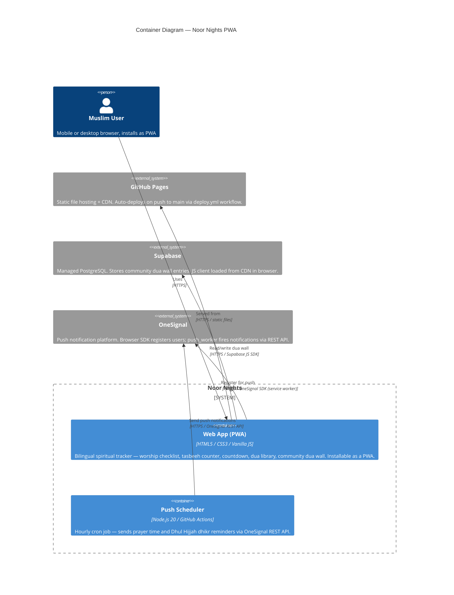

# Noor Nights — C4 Level 2: Container Diagram

> **Note**: this diagram was auto-generated by /handover on 2026-05-18 from repo signals (index.html, manifest.json, sw.js, automated_hourly_push.js, deploy.yml, ramadan_hourly_push.yml). It is a **starting point** — review and refine.
> - Container labels and tech strings — the detector may have picked a framework version wrong
> - Inferred relationships — user → web assumes HTTPS; adjust if your stack uses something else
> - External systems — anything your team uses that isn't in the repo (e.g. Umm al-Qura calendar API for dynamic Hijri date calculation) won't have been detected
>
> Update the "Maintenance" section below once the diagram is stable.

## Maintenance

(From the template — update when L2 containers change.)
